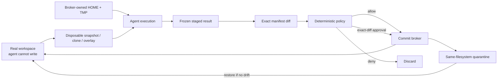

# Agent Workspace Guard

[](https://github.com/dmonsta86/agent-workspace-guard/actions/workflows/test.yml)
[](pyproject.toml)
[](LICENSE)

**A transactional persistence boundary for coding agents.**

Agent Workspace Guard (AWG) is an independent RFC and executable reference implementation for limiting the blast radius of malformed cleanup, deletion, overwrite, rename, and tool-induced filesystem mutations.

> **Core invariant:** During ordinary execution, the agent cannot write the live workspace or real home. It writes a disposable transaction; a separate trusted broker persists only one exact, signed, policy-approved filesystem result.

**Review path:** [five-minute architecture](docs/ONE_PAGE.md) · [full RFC](docs/RFC.md) · [security argument](docs/SECURITY_ARGUMENT.md) · [production checklist](docs/IMPLEMENTATION_CHECKLIST.md) · [reviewer guide](START_HERE.md)

Command classifiers, model instructions, approval prompts, automatic review, and replay evaluations remain useful. They no longer have to recognize every way arbitrary code can modify a filesystem in order to protect host files.

> **Status:** RFC-quality design and standard-library-only Python reference implementation. It demonstrates the protocol, result policy, integrity checks, quarantine-first commit, restore behavior, and evaluations. It is not a standalone OS sandbox. Production use requires the authority separation and platform work in [`docs/PRODUCTION_HARDENING.md`](docs/PRODUCTION_HARDENING.md).

## Why this design

A free-form coding agent can reach deletion or overwrite through shell commands, aliases, nested interpreters, package hooks, build systems, native binaries, language APIs, symlink behavior, and tools that do not exist yet. A lexical filter can route known risk but cannot generally prove the final runtime target.

AWG changes the consequence of a miss:



An unrecognized `rm`, `find -delete`, `git clean`, `Remove-Item`, `rd /s /q`, `shutil.rmtree`, package script, or native helper can destroy only the disposable transaction when the OS sandbox is configured correctly.

## End-to-end protocol

1. **Begin:** a trusted host creates a fresh transaction, worktree, home, temp root, baseline identity, and signed receipt.
2. **Execute:** the agent receives write authority only inside those transaction roots. The real workspace, real home, broker state, and quarantine are not writable.
3. **Freeze and plan:** the broker captures the staged generation and computes exact path/type/hash changes against the baseline, binding the plan to a protocol version and policy digest.
4. **Decide:** small ordinary add-only plans may pass automatically. Existing-file changes, deletions, type changes, executable additions, sensitive paths, and safe in-workspace symlinks require review. Protected paths, escaping symlinks, special files, excessive plans, and mass deletion are denied under normal policy.
5. **Approve:** approval is signed, short-lived, and bound to the full plan fingerprint. It is not a reusable command-prefix permission.
6. **Commit:** existing targets are renamed into same-filesystem quarantine before prevalidated staged entries are installed. The final tree must match the approved staged digest.
7. **Restore or retain:** restore is permitted only while the live workspace still matches the committed digest. Permanent purge is a separate broker-owned retention action.
8. **Dispose:** the broker removes task state by opaque transaction identity. The model never generates a cleanup path for broker-owned state.

## Target production invariants

1. **No ambient host mutation authority.** Arbitrary agent code can write only transaction roots under the stated sandbox assumption.
2. **Broker-owned temporary provenance.** A path is temporary because the broker created it fresh and issued a receipt—not because the model named or assigned it.
3. **Result-based mediation.** Persistence policy evaluates exact paths, types, hashes, counts, and bytes after execution.
4. **Non-transferable approval.** Any change to the plan, policy, baseline, staged tree, state, path set, mode, or symlink target invalidates approval.
5. **Quarantine before replacement.** The broker does not recursively delete user paths during commit.
6. **Drift fails closed.** Real-workspace drift, staged drift, expired plans, corrupt state, path ambiguity, and unsupported entries stop the operation.
7. **Command inspection is advisory.** It catches obvious catastrophic intent and improves feedback/evaluations, but it is not represented as proof of safety.
8. **Full access is not persistence authority.** Broad process, network, or read access should not silently disable the workspace transaction boundary.

These are conditional production properties, not claims that the Python process supplies kernel isolation. The assumptions, properties, and proof sketch are specified in [`docs/SECURITY_ARGUMENT.md`](docs/SECURITY_ARGUMENT.md).

## How it addresses the reported failure class

| Reported concern | Architectural control |
|---|---|
| A system variable such as `HOME` is reused for scratch state | The host creates a disposable per-task home; the real home is not writable. Broker-owned roots cannot gain or lose provenance through model assignments. |
| Cleanup points at the wrong directory | Normal cleanup is `discard(transaction_id)`, not model-generated recursive deletion. A malformed command remains confined to disposable state. |
| A temporary path already exists | The broker creates a fresh opaque namespace and refuses caller-selected pre-existing roots. |
| A deletion form is not recognized | The sandbox prevents host mutation; the exact staged diff reveals the evaluated result regardless of command language. |
| Auto-review approves the wrong thing | Review approves a signed concrete result plan, not a textual command whose effect can vary. |
| Full access is enabled accidentally | Host persistence remains a separate capability; true direct mutation is explicit break-glass behavior. |
| A delete or overwrite succeeds before review | The real workspace is outside the agent's write authority; only the broker can commit. |

## What is included

- Transaction lifecycle with isolated worktree, `HOME`, `CODEX_HOME`, and temp roots.
- Content-hashed semantic manifests and diffs.
- Signed transaction state, versioned policy-bound plans, approvals, commit records, and audit events.
- Add-only automatic policy, destructive-result review, and hard-denial policy.
- Unsafe-symlink, protected-path, special-file, executable-addition, sensitive-path, change-budget, and mass-deletion controls.
- Quarantine-first commit, rollback, conservative restore, and drift detection.
- A defense-in-depth cross-shell command inspector that emits hashes/lengths rather than command contents.
- A replay corpus covering Bash, PowerShell, Cmd, nested language APIs, environment expansion, root targets, and safe controls.
- A Codex integration proposal, formal security argument, threat model, production implementation checklist, hardening requirements, rollout plan, and issue-ready submission.
- No runtime dependencies beyond Python 3.11+.

## Verification

```bash
./scripts/verify.sh
```

The packaged verification run passes:

- **36 unit/integration tests**
- **28/28 destructive-command replay cases**
- repository-manifest verification, Python compilation, and CLI smoke checks

GitHub Actions runs the suite on Python 3.11 and 3.13 across Linux, macOS, and Windows. The workflow also verifies the source manifest, package installation, compilation, replay corpus, and installed CLI.

## Minimal reference API

```python
from pathlib import Path
from agent_workspace_guard import Decision, WorkspaceGuard

workspace = Path("/absolute/path/to/project")
state = workspace.parent / ".awg-state"  # same filesystem; outside project

guard = WorkspaceGuard(state)
transaction = guard.begin(workspace, task_id="task-123")

# A real deployment must give the untrusted agent only this cwd/environment
# through an OS-enforced sandbox. The Python object does not create that sandbox.
environment = guard.environment(transaction.transaction_id)
agent_cwd = transaction.worktree_root

# ...agent runs and edits only agent_cwd...

plan = guard.plan(transaction.transaction_id)
if plan.decision is Decision.DENY:
    raise RuntimeError(plan.findings)
if plan.decision is Decision.REQUIRE_APPROVAL:
    token = guard.approve(plan.plan_id, actor="user-or-trusted-reviewer")
    commit = guard.commit(plan.plan_id, approval_token=token.token_id)
else:
    commit = guard.commit(plan.plan_id)

# Restore only succeeds while no later workspace drift exists.
guard.restore(commit.commit_id)
```

Run the toy demonstration:

```bash
PYTHONPATH=src python3 examples/demo.py
```

Build and independently verify the submission ZIP, Git bundle, and wheel from a clean tagged checkout:

```bash
python3 scripts/package_release.py --output release
```

## CLI

```text
awg --state /same/filesystem/state begin --workspace /project --task-id task-123
awg --state /same/filesystem/state env --transaction tx_...
awg --state /same/filesystem/state plan --transaction tx_...
awg --state /same/filesystem/state approve --plan plan_... --actor local-user
awg --state /same/filesystem/state commit --plan plan_... --token approval_...
awg --state /same/filesystem/state restore --commit commit_...
awg inspect --shell bash --command-text 'git clean -fdx'
```

The `inspect` output intentionally does not echo the command. It reports a SHA-256 digest and character count to reduce accidental secret leakage in telemetry.

## Production boundary

The reference copy backend excludes `.git` and broker metadata. A production integration must not expose a writable `.git` pointer into the user's real repository. Use a filesystem snapshot/overlay or a fully isolated disposable clone; provide history through a read-only/proxied VCS interface where needed.

Before claiming the security properties in production, the implementation must also provide:

- kernel-enforced write isolation;
- a broker process/principal unavailable to the agent;
- immutable/frozen staged generations;
- handle-relative, no-follow commit operations;
- durable crash recovery and single-writer coordination;
- platform-specific treatment of reparse points, hard links, ACLs, extended attributes, case folding, and mount boundaries;
- protected quarantine, retention, quotas, and independent purge authorization.

See [`docs/IMPLEMENTATION_CHECKLIST.md`](docs/IMPLEMENTATION_CHECKLIST.md) and [`docs/PRODUCTION_HARDENING.md`](docs/PRODUCTION_HARDENING.md).

## Submission route

A directly related upstream Codex discussion already exists in [`openai/codex#33624`](https://github.com/openai/codex/issues/33624). The preferred contribution is the concise, implementation-focused comment in [`submission/OPENAI_CODEX_COMMENT.md`](submission/OPENAI_CODEX_COMMENT.md), rather than a duplicate issue. The public X reply is in [`submission/TIBO_REPLY.md`](submission/TIBO_REPLY.md).

## Repository map

```text
START_HERE.md                    reviewer guide and current submission route
src/agent_workspace_guard/       runnable reference implementation
tests/                           unit and integration tests
evals/                           cross-shell destructive replay corpus
docs/ONE_PAGE.md                 five-minute architecture summary
docs/RFC.md                      complete architecture proposal
docs/SECURITY_ARGUMENT.md        assumptions, properties, proof sketch
docs/THREAT_MODEL.md             adversary model and residual risk
docs/CODEX_INTEGRATION.md        proposed Codex/Rust integration
docs/IMPLEMENTATION_CHECKLIST.md production integration gates
docs/PRODUCTION_HARDENING.md     mandatory platform hardening work
docs/ROLLOUT_AND_EVALUATION.md   staged adoption and acceptance gates
docs/WHY_FILTERS_ARE_NOT_BOUNDARIES.md
docs/ORIGINAL_PACKET_REVIEW.md   audit of the supplied regex packet
docs/DESIGN_DECISIONS.md         selected and rejected alternatives
docs/REFERENCES.md               primary references
submission/OPENAI_CODEX_COMMENT.md concise comment for the related upstream issue
submission/GITHUB_ISSUE.md       standalone issue fallback
submission/REPOSITORY_METADATA.md GitHub About description and topics
submission/RELEASE_NOTES_v0.2.3.md release description
submission/SUBMISSION_ROUTE.md   current publishing and disclosure route
schemas/                         machine-readable plan schema
scripts/verify_manifest.py        repository integrity verification
scripts/package_release.py        reproducible, independently checked release artifacts
CHANGELOG.md                     release history
```

## License and independence

MIT. This is an independent proposal and is not an OpenAI product, endorsement, or claim about undisclosed implementation details.
