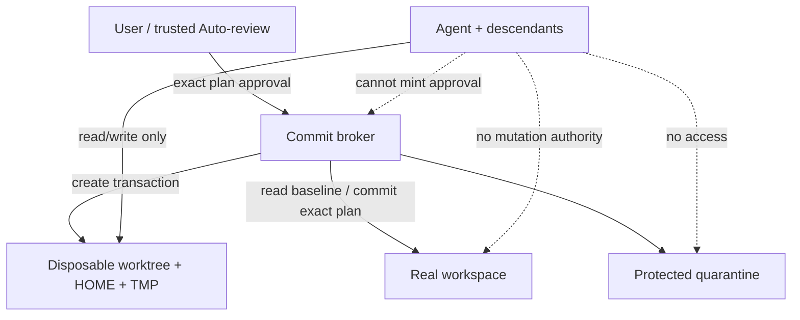

# RFC: Transactional Persistence Boundary for Coding Agents

## Status

**Proposed — independent design submission.**

This RFC is accompanied by an executable Python reference implementation. Normative production requirements are stated with **MUST**, **SHOULD**, and **MAY**. The Python code demonstrates protocol behavior; it is not a replacement for an OS sandbox or platform-native commit service.

## Abstract

Coding agents need broad freedom inside a project, but a free-form shell can reach deletion, truncation, rename-overwrite, and replacement through an unbounded set of tools and languages. Improving instructions, command checks, approval UX, automatic review, evaluations, and training reduces risk, but none of those layers should carry the entire guarantee while the agent still has direct write authority over user files.

This RFC introduces a **Transactional Persistence Boundary (TPB)**:

1. each task executes in a disposable workspace generation with broker-created home and temp roots;
2. the agent has no write authority over the real workspace, real home, broker state, or quarantine;
3. a separate broker freezes the staged result and computes an exact semantic diff;
4. policy and any approval are bound to the complete plan fingerprint;
5. existing live entries are moved into same-filesystem quarantine before approved replacements are installed;
6. cleanup and purge operate only on broker-owned opaque identities.

The design protects persistence rather than attempting to enumerate every destructive command. A classifier miss can damage task state, but cannot directly damage host files under the stated sandbox assumptions.

## 1. Motivation

The desired invariant is not:

> Every dangerous command is recognized.

It is:

> Arbitrary code in the agent execution domain cannot mutate protected host files; only one exact, fresh, policy-authorized result can be persisted by a trusted broker.

This distinction matters because the final effect of a command can depend on runtime expansion, cwd, configuration, package hooks, nested interpreters, native code, symlink/reparse behavior, mount state, case rules, and concurrent processes. New tools create new mutation paths without changing the underlying filesystem authority problem.

## 2. Goals

- Prevent accidental or adversarial agent execution from directly deleting, truncating, replacing, renaming, or changing metadata on the real workspace and real home.
- Preserve ordinary coding workflows, including compilers, package managers, tests, scripts, nested shells, and native programs inside the transaction.
- Make each real-workspace effect explicit, exact, reviewable, auditable, short-lived, and recoverable.
- Eliminate model-generated cleanup paths for broker-owned task state.
- Separate process/network/read permissions from real-workspace persistence authority.
- Fail closed on stale generations, corrupt state, unsafe paths, unsupported entry types, mount/device ambiguity, excessive plans, and unavailable platform guarantees.
- Integrate with existing command safety, execution policy, automatic review, and evaluation systems.

## 3. Non-goals

- Proving that approved source code is semantically safe or correct.
- Preventing exfiltration of data that a network-enabled agent is permitted to read.
- Protecting against a compromised kernel, administrator, user account, broker binary, or reviewer.
- Automatically merging arbitrary concurrent edits.
- Treating quarantine as an independent backup.
- Making direct-host break-glass execution safe; that mode intentionally weakens the primary invariant.

## 4. Authority architecture



### 4.1 Agent capability

The agent process and all descendants **MUST** be unable to write, truncate, unlink, rename, change ACLs, mount over, or otherwise mutate:

- the real workspace;
- the real home/profile and application state;
- broker state, signing keys, IPC credentials, and quarantine;
- unrelated host paths.

The agent **MAY** receive read access to approved inputs. Prefer exposing only the staged tree. Any real-workspace view should be read-only and unnecessary for commit.

### 4.2 Broker capability

The broker **MUST** run outside the agent sandbox with a narrowly scoped identity. It may:

- create/dispose transaction roots;
- read baseline and frozen staged generations;
- issue signed plans and approvals through authenticated flows;
- move exact planned entries between live workspace, staging, and quarantine;
- restore or purge only through structured operations.

The broker **MUST NOT** execute model-generated shell cleanup against host paths.

## 5. Transaction lifecycle

### 5.1 Begin

A trusted component creates:

- an opaque transaction ID;
- a stable baseline generation identity;
- a writable disposable staged tree;
- fresh per-task `HOME`/`USERPROFILE`;
- fresh per-task `TMPDIR`/`TMP`/`TEMP`;
- fresh `CODEX_HOME` and platform application-state roots;
- a signed transaction receipt containing workspace, generation, roots, state, and creation time.

The roots **MUST** be newly created by the broker. A caller-selected existing path cannot acquire temporary trust.

The model receives the staged cwd and process environment. It does not select, repurpose, or clean broker roots.

### 5.2 Execute

The agent runs normal tools inside the transaction. Existing command policy remains active:

- obvious root/home/profile, privilege, mount, filesystem-format, device, and ACL intent may be denied immediately;
- destructive worktree commands may trigger warning, checkpoint, or approval routing;
- a command classified as safe still has no host persistence authority;
- a prefix approval authorizes execution behavior, not the eventual host diff.

### 5.3 Freeze

Before planning, the system **MUST** obtain a stable staged generation. Preferred mechanisms include a filesystem snapshot, immutable content-addressed tree, frozen overlay generation, or equivalent writer exclusion.

A production implementation must not derive approval from a tree that the agent can continue mutating.

### 5.4 Plan

The broker compares the baseline generation with the frozen staged generation and emits a canonical plan. Each change contains:

- normalized relative path;
- operation kind: add, modify, delete, or type change;
- before/after entry type;
- before/after content or metadata identity;
- relevant size and mode information.

The plan also contains:

- transaction, task, user/session, and workspace identities;
- baseline and staged generation digests;
- exact change list and aggregate counts/bytes;
- deterministic findings and decision;
- protocol version and digest of the complete policy configuration;
- creation, expiry, and state;
- random plan ID;
- fingerprint over the immutable plan;
- broker signature.

Absolute, drive-qualified, UNC, empty, dot, parent, non-normalized, escaping symlink/reparse, and unsupported path forms **MUST** fail closed.

### 5.5 Policy

A recommended ordinary policy is:

| Result | Default |
|---|---|
| No changes | Allow/discard without mutation |
| Small add-only regular files/directories | Allow within strict count/byte budgets |
| Add executable content | Require exact-diff review |
| Modify existing content or metadata | Require exact-diff review |
| Delete existing entry | Require exact-diff review |
| Type change | Require exact-diff review |
| Safe relative in-workspace symlink | Require exact-diff review |
| Sensitive-looking path | Require exact-diff review |
| Protected VCS/broker path | Deny |
| Absolute/escaping symlink or reparse target | Deny |
| Device, socket, FIFO, or unsupported special file | Deny |
| Excessive total change budget | Deny |
| Mass deletion under ordinary policy | Deny; separate break-glass policy required |
| Cross-mount/device ambiguity | Deny |

Policy should be one semantic core with platform adapters, not separately drifting rule sets per shell language.

### 5.6 Approval

Approval **MUST** be attached to the exact plan result, not an opaque command.

A token includes:

- token and plan IDs;
- complete plan fingerprint;
- user/session/workspace binding;
- reviewer identity and review type;
- creation and expiration times;
- broker signature.

Tokens should be short-lived and single-purpose. Any protocol, policy, plan, staged generation, baseline, path, type, hash, mode, finding, or expiry change creates a new fingerprint and requires a new decision.

The agent process cannot mint the token. A hard denial cannot be converted into an ordinary approval by the model.

### 5.7 Commit

The broker **MUST**:

1. reverify transaction, protocol/policy identity, plan, decision, approval, expiry, and terminal state;
2. rebind to the same baseline and frozen staged generation, then deterministically re-evaluate the bound policy;
3. pre-stage all new entries on the live workspace filesystem;
4. durably journal intent and expected identities;
5. for each existing operation root, atomically move the live entry to protected same-filesystem quarantine;
6. install the prevalidated staged entry into the now-empty destination;
7. durably record each transition;
8. verify the final live generation equals the approved staged generation;
9. roll back or enter an explicit repair state on mismatch;
10. mark plan and transaction terminal and emit an authenticated audit event.

The normal broker mutation vocabulary is intentionally small: move existing planned entry to quarantine, install planned staged entry, roll back, and restore.

### 5.8 Restore

Restore is permitted only when the current live generation equals the commit's recorded post-state. This prevents restoration from overwriting work created later by a user or another tool.

Restore moves current committed entries aside, reinstalls quarantined entries, verifies the original generation, and journals the operation.

### 5.9 Discard and purge

Transaction cleanup is `discard(transaction_id)`. The broker validates that the object is broker-owned and strictly beneath broker state before deletion.

Quarantine purge is a separate retention operation. It **MUST**:

- accept broker-owned quarantine identity, not a model path;
- be independently authorized from the original commit;
- enforce retention, quota, legal/privacy, and recovery policy;
- never recursively delete from a user-supplied root.

## 6. Permission semantics

Execution, network, reads, sandbox expansion, exact-result persistence, quarantine purge, and direct-host mutation are distinct capabilities.

“Full access” **SHOULD NOT** automatically disable the transactional persistence boundary. If direct host mutation is necessary, it should be an explicit break-glass capability that is:

- separately named and visually distinct;
- nonpersistent by default;
- narrowly scoped and time-limited;
- unavailable to automatic model self-approval;
- accompanied by a recovery warning and telemetry;
- excluded from claims that depend on host confinement.

## 7. State machines

### 7.1 Transaction and plan

```text
TRANSACTION: OPEN -> PLANNED -> COMMITTED
                    |
                    +-----------> DISCARDED (before commit only)

PLAN: PENDING -> COMMITTED
        |
        +------> INVALIDATED / EXPIRED / DENIED
```

Only one terminal commit may consume a plan. Multiple plans may be created for a transaction, but committing one makes other plans stale through transaction/live-generation state.

### 7.2 Commit journal

```text
PREPARED
  -> MOVING_BACKUP
  -> BACKUP_MOVED
  -> INSTALLING
  -> INSTALLED
  -> COMPLETE

failure -> reverse journal -> ROLLED_BACK
ambiguous crash recovery -> REPAIR_REQUIRED (production)
```

Each transition must be recoverable after process or host restart.

## 8. Mapping to the reported concerns

### System environment variable reused for temporary work

The real home/profile is outside agent write authority. The broker creates a disposable task home and temp namespace. Reassigning process-local variables cannot grant access to protected roots. Normal cleanup uses transaction identity.

### Malformed cleanup command points at user files

The malformed command executes only inside the transaction authority set. The real workspace/home cannot be reached for mutation. Even if the task state is destroyed, disposal remains safe and the host state is unchanged.

### Temporary destination already exists

The broker creates a fresh opaque root and refuses caller-selected existing roots. Provenance is an issued capability, not a pathname heuristic.

### Unknown deletion or overwrite mechanism

All arbitrary code remains confined. Planning observes the evaluated staged result, so the resulting deletion appears regardless of originating syntax or language.

### Automatic review misses destructive intent

Automatic review receives exact changes after evaluation. Its approval is cryptographically bound to that result and cannot authorize a later-mutated tree.

### Full access or risky permission combination

Persistence authority stays separate. Broad runtime permissions do not become an implicit wildcard write grant to the user's workspace.

### Training/evaluation contamination

Evaluation labels should distinguish command-level routing from host-state outcomes. Destructive action traces should not teach raw cleanup against host paths; broker lifecycle APIs and exact-result review become the preferred action representation.

## 9. Correctness and failure handling

The system fails closed when:

- baseline or staged generation identity is unavailable or changes;
- state signatures, object IDs, states, lifetimes, or manifest contents are inconsistent;
- the live workspace drifts before commit;
- an approval is missing, expired, for another fingerprint, or outlives its plan;
- a path is non-normalized, escaping, special, protected, cross-device, or unsupported;
- staging/quarantine cannot occur atomically on the live filesystem;
- disk space, journal durability, or platform semantics are insufficient;
- post-commit or rollback verification does not match the expected generation.

The UI should surface a retry/rebase or repair state. It must not silently weaken policy or fall back to raw host execution.

## 10. Performance and storage

The reference implementation performs full copies and full content hashing for clarity. Production should use platform-appropriate optimizations while preserving generation identity and the protocol:

- copy-on-write filesystem snapshots or clones;
- overlay/union filesystems with a per-task upper layer;
- reflinks;
- incremental content-addressed manifests;
- trusted change journals combined with periodic full verification;
- deduplicated encrypted quarantine.

A shared writable `.git` pointer is not a safe isolation backend. A Git worktree can reference common repository metadata. Production should use a filesystem snapshot/overlay of the working tree, a fully isolated disposable clone, or a VCS service that exposes history read-only and commits through a broker.

Measure startup, plan, commit, storage amplification, invalidation, and compatibility percentiles before making performance claims.

## 11. Privacy and telemetry

Default telemetry should avoid raw commands, file contents, secrets, and full personal paths. Prefer:

- command digest and length;
- decision/finding codes;
- path-category or redacted relative-path statistics;
- counts, byte totals, and deletion fraction;
- plan invalidation reason;
- commit, rollback, restore, and repair outcome;
- latency/storage distributions;
- sandbox denial and compatibility failures.

Detailed artifacts should remain local unless the user explicitly submits a sanitized report.

## 12. Evaluation contract

A destructive replay passes only when:

1. the real workspace and real home remain unchanged before commit;
2. the staged consequence is represented exactly in the plan;
3. policy and approval behavior match expectation;
4. changed state cannot reuse approval;
5. commit reaches exactly the approved generation or restores the baseline;
6. replaced/deleted entries remain in quarantine until independent purge;
7. cleanup cannot be redirected through a model-controlled path.

Classifier recall is a secondary metric. The primary metric is protected host state.

## 13. Rollout

1. **Shadow planning:** compute plans and compare them with observed task changes; no behavior change.
2. **Disposable execution pilot:** run selected sessions in isolated transaction roots and measure compatibility.
3. **Exact-result approval:** introduce a distinct approval object and UI for persistence.
4. **Quarantine commit pilot:** enable broker commits for supported filesystem/platform combinations.
5. **Default transactional persistence:** use for ordinary approval modes after property tests and recovery drills pass.
6. **Full-access split:** keep direct host mutation as separate break-glass behavior.
7. **Optimize backends:** snapshots, overlays, reflinks, journals, and deduplication without changing authorization semantics.
8. **Continuous adversarial evaluation:** replay every observed failure and generate variants across shells, languages, platforms, races, and crash points.

Detailed gates are in [`ROLLOUT_AND_EVALUATION.md`](ROLLOUT_AND_EVALUATION.md).

## 14. Reference implementation

The included Python package implements:

- signed transaction/plan/approval/commit state;
- recomputed manifests and exact semantic diffs;
- bounded TTLs and object/path identity checks;
- policy outcomes and findings;
- quarantine-first commit, rollback, and drift-safe restore;
- authenticated audit chaining;
- secret-free command inspection telemetry;
- unit/integration and replay tests.

It intentionally does not claim kernel isolation, immutable snapshots, complete crash recovery, cross-process broker coordination, or handle-relative production path safety. Those are mandatory integration tasks, not optional refinements.
